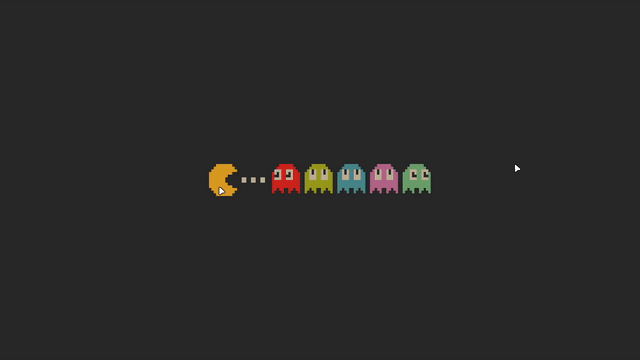

# coomer

Zoomer application for everyone on Linux.



## Features

- **Multi-backend support**: Automatic selection between wlr-screencopy, xdg-desktop-portal, and X11
- **Multi-monitor support**: Capture specific monitor or all monitors (X11/wlr)

## Installation

### AppImage
Download an AppImage from [releases](https://github.com/yuzujr/coomer/releases).

### Arch Linux (AUR)
* `coomer` — build from source
* `coomer-bin` — AppImage

Install one of them:

use `paru`:
```bash
paru -S coomer
# or
paru -S coomer-bin
```

or use `yay`:
```bash
yay -S coomer
# or
yay -S coomer-bin
```

### NixOS

Add to your `flake.nix`:

```nix
inputs.coomer.url = "github:yuzujr/coomer";
```

Then in your NixOS configuration:

```nix
environment.systemPackages = [
  inputs.coomer.packages.${pkgs.system}.default
];
```

Or try it without installing:

```bash
nix run github:yuzujr/coomer
```

### Build from Source

Requirements:

- Linux
- `clang` or `g++` with C17/C++17 support
- `pkg-config`
- `make`
- `libGL` and `libEGL`
- `wayland-scanner` when Wayland support is enabled
- `libX11` and `libXrandr` when X11 support is enabled
- `wayland`, `wayland-egl`, and `libxkbcommon` when Wayland support is enabled
- `dbus` when portal support is enabled

By default, `make` builds all features:

- `X11=1`
- `WAYLAND=1`
- `PORTAL=1`

Examples:

```bash
# X11 only
make WAYLAND=0 PORTAL=0 -j"$(nproc)"
sudo make WAYLAND=0 PORTAL=0 install PREFIX=/usr

# Wayland only, no portal
make X11=0 PORTAL=0 -j"$(nproc)"
sudo make X11=0 PORTAL=0 install PREFIX=/usr

# Full build, but without portal support
make PORTAL=0 -j"$(nproc)"
sudo make PORTAL=0 install PREFIX=/usr
```

## Usage

```
Usage: coomer [options]

Options:
  --backend <mode>       Capture backend: auto|x11|wlr|portal (default: auto)
  --monitor <name>       Select monitor/output by name (x11/wlr only, use 'all' to capture all monitors)
  --list-monitors        List monitors/outputs visible to the backend (x11/wlr only)
  --overlay              Wayland layer-shell overlay (wlr/portal only)
  --portal-interactive   Enable interactive mode for portal (show selection dialog)
  --no-spotlight         Disable spotlight mode
  --version              Show version
  --debug                Enable debug logging
  --help, -h             Show this help message

Hotkeys:
  Q or A or Right click: quit
  Hold Left click: pan
  Scroll wheel: zoom
  Hold Ctrl: spotlight (Ctrl + wheel to resize)
```

**Note**: On Wayland with multiple monitors, the portal backend only supports fullscreen capture, which may include unwanted areas. Use `--portal-interactive` to show a selection dialog on each launch, allowing you to choose the capture mode.

## Backend Selection

### Auto Mode (Default)

Priority order:
1. **X11** — if `$DISPLAY` is set
2. **wlr-screencopy** — if compositor supports wlr protocols (Hyprland, Sway, niri)
3. **portal** — fallback (all modern Wayland compositors)

### Manual Selection

```bash
# wlr-screencopy:
coomer --backend wlr

# Portal: may require authorization
coomer --backend portal

# X11:
coomer --backend x11
```

## Architecture

```
┌─────────────┐
│   coomer    │
├─────────────┤
│ Capture     │──┬─→ wlr-screencopy (Wayland)
│ Backend     │  ├─→ xdg-desktop-portal (Wayland/X11)
│             │  └─→ XGetImage (X11)
├─────────────┤
│ Window      │──┬─→ layer-shell EGL (Wayland overlay)
│ Backend     │  ├─→ xdg-shell EGL (Wayland fullscreen)
│             │  └─→ GLX (X11 fullscreen)
├─────────────┤
│ Renderer    │──→ OpenGL 3.3 Core (embedded shaders)
└─────────────┘
```

## Acknowledgements

This project was inspired by:

- **[boomer](https://github.com/tsoding/boomer)** by [@tsoding](https://github.com/tsoding) — Original zoomer application.
- **[woomer](https://github.com/coffeeispower/woomer)** by [@coffeeispower](https://github.com/coffeeispower) — A Wayland (wlroots) port of boomer.

## License

MIT
